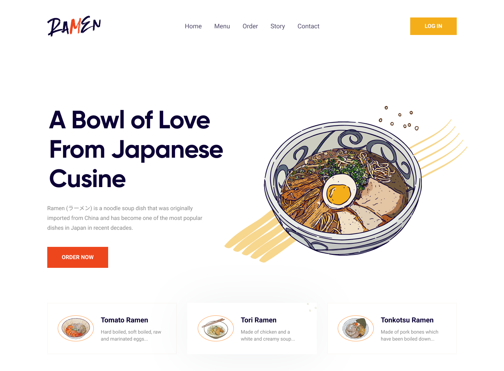

# Ramen restaurant landing page.

## Welcome! 👋

Thank you for taking out time to check out this project.

**To complete this project, I made use of HTML, CSS and Vanilla Js- basically for the mobile navigation toggle**

## The Project

This is the second challenge put together by [Bahd Coder](https://twitter.com/bahdcoder). The project is a landing page for Ramen Restaurant. The design was provided by [Bahd Coder](https://twitter.com/bahdcoder), just like the [Product designer full portfolio landing page](https://github.com/uzoway/product-designer-landing), I developed it making sure it looked as close to the design as possible.

I also ensured the users were able to:

- See hover states for all interactive elements on the page
- View the site on various mobile screen sizes- 414px, 375px, 320px...

During the course of completing the project, I didn't encounter much challenge as i just took it to practice, with focus on:

- Building a project from scratch using data and files exported from figma.
- Improving my skills working on a real-life workflow.
- And lastly my JavaScript skills.

🚀
